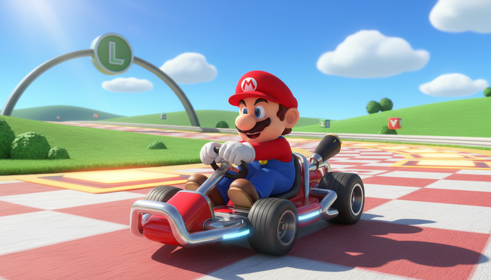
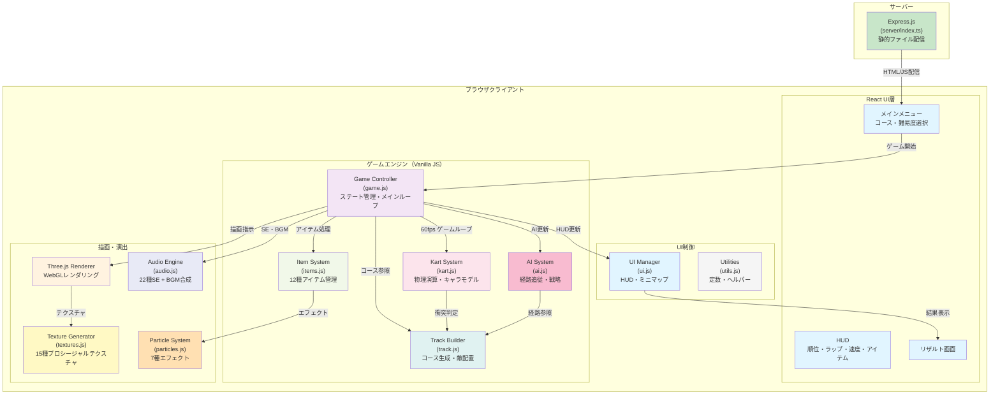
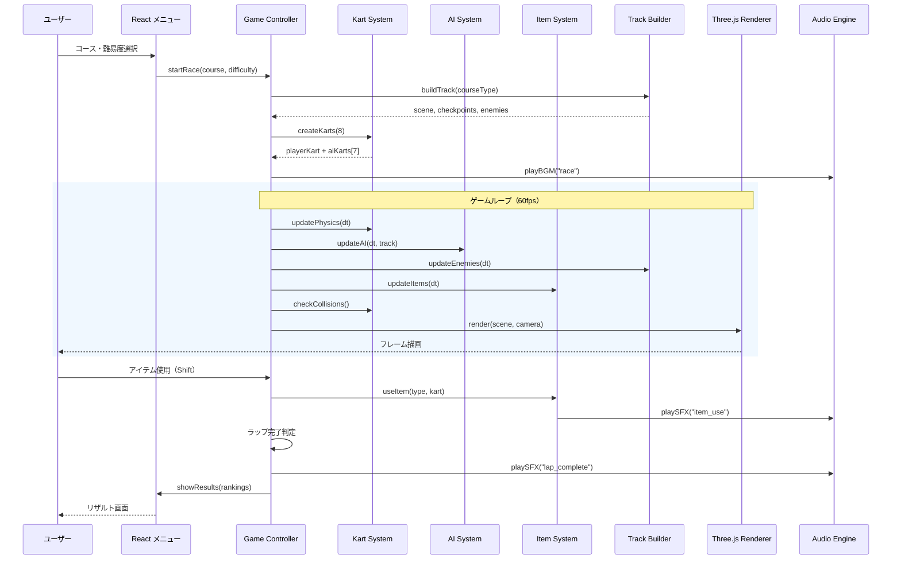
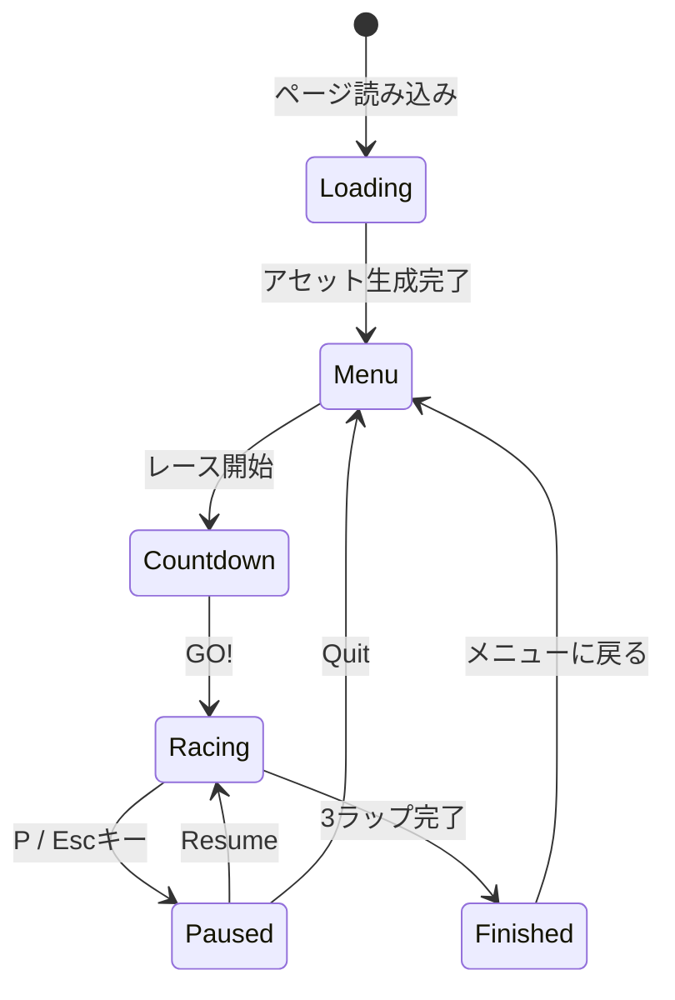

# 🏎️ Super Mario Kart 3D

> **ブラウザで遊べる、本格3Dカートレーシングゲーム**

Three.js による完全プロシージャル 3D グラフィックス、Web Audio API によるリアルタイム音声合成、8カート同時レースの AI対戦 ── すべてを外部アセット不要で実現した、フルスタック JavaScript レーシングゲームです。



---

## 目次

1. [ゲーム概要](#ゲーム概要)
2. [ゲームモード](#ゲームモード)
3. [コース一覧](#コース一覧)
4. [キャラクター](#キャラクター)
5. [アイテムシステム](#アイテムシステム)
6. [操作方法](#操作方法)
7. [ゲームメカニクス](#ゲームメカニクス)
8. [敵キャラクター](#敵キャラクター)
9. [システムアーキテクチャ](#システムアーキテクチャ)
10. [ファイル構成](#ファイル構成)
11. [技術仕様](#技術仕様)
12. [セットアップ・開発](#セットアップ開発)
13. [ライセンス](#ライセンス)

---

## ゲーム概要

**Super Mario Kart 3D** は、任天堂マリオカートシリーズにインスパイアされた Web ベースの 3D カートレーシングゲームです。

### 主な特徴

| カテゴリ | 内容 |
|---------|------|
| **完全プロシージャル** | テクスチャ・3Dモデル・音声・BGM すべてをコードのみで生成（外部アセットファイル不要） |
| **3コース** | 草原サーキット・雪原コース・クッパ城の3ステージ |
| **8人同時レース** | プレイヤー1名 + AI 7名によるフルグリッドレース |
| **12種のアイテム** | コウラ・スター・キノコ・サンダーなど原作準拠のアイテム群 |
| **3段階ドリフト** | ミニターボチャージを伴うスキルベースのドリフトシステム |
| **AI難易度3段階** | 50cc / 100cc / 150cc のスピードクラス |
| **Mario 64風キャラモデル** | 8キャラクターそれぞれに精緻な3Dモデル |
| **レスポンシブUI** | デスクトップ・タブレット対応 |

---

## ゲームモード

### 難易度（スピードクラス）

| 難易度 | CC | 速度倍率 | AI特性 |
|--------|-----|---------|--------|
| **Easy** | 50cc | ×1.0 | 反応遅め、ミス多め、アイテム使用率50% |
| **Normal** | 100cc | ×1.3 | バランス型、ドリフト活用、アイテム使用率70% |
| **Hard** | 150cc | ×1.6 | 最速、最適ライン走行、アイテム使用率90% |

### レース形式

- **参加台数**: 8台（プレイヤー1 + AI 7）
- **ラップ数**: 3周
- **順位計算**: コース進行度ベースのリアルタイム計算
- **レース結果**: 全レーサーのタイム付きリザルト表示

---

## コース一覧

### 🌿 マリオサーキット（Grassland）

広大な草原を駆け抜けるスタンダードコース。緩やかなカーブと直線セクションのバランスが良く、初心者にもおすすめ。

- **背景**: 青空、遠方の山脈
- **装飾**: 花、木、パームツリー、観客席、木製フェンス
- **敵**: パックンフラワー(5)、ノコノコ(4)、クリボー(5)、ワンワン(2)、ジュゲム(1)

### ❄️ フラッペスノーランド（Snow）

氷原と急カーブが特徴のテクニカルコース。氷の池ではスリップに注意。

- **背景**: 水色の空、雪山
- **装飾**: 雪のモミの木、氷の湖、雪だるま
- **敵**: ペンギン(5)、歩く雪だるま(4)、アイスブロス(2)
- **ギミック**: 凍った池（スリップエリア）×3

### 🏰 クッパキャッスル（Castle）

溶岩と暗闇が支配する高難度コース。直角カーブと多数のトラップが行く手を阻む。

- **背景**: 暗紫灰色の空
- **装飾**: 城壁、溶岩、石畳、炎の柱
- **敵**: ドッスン(3)、テレサ(4)、ワンワン(2)、カロン(3)、ファイアバー(4)
- **ギミック**: 炎の柱(2)、溶岩エリア

---

## キャラクター

8名のプレイアブルキャラクター。各キャラクターは Mario 64 スタイルの精緻な 3D モデルで表現されています。

| # | キャラクター | タイプ | カートスタイル | 特徴 |
|---|-------------|--------|--------------|------|
| 1 | **マリオ** | Human | Standard | 赤い帽子＋「M」エンブレム、波型ヒゲ |
| 2 | **ルイージ** | Human | Standard | 緑の帽子＋「L」エンブレム、波型ヒゲ |
| 3 | **ピーチ** | Princess | Elegant | ピンクドレス、王冠、ロングヘア、背面リボン |
| 4 | **キノピオ** | Toad | Compact | 巨大キノコ帽（斑点付き）、ベスト |
| 5 | **ヨッシー** | Yoshi | Sporty | 飛び出し目、赤い鞍、しっぽ、トサカ |
| 6 | **ワリオ** | Human | Heavy | 黄色帽子＋「W」エンブレム、ギザギザヒゲ |
| 7 | **ドンキーコング** | DK | Heavy | 毛皮テクスチャ、赤ネクタイ「DK」ロゴ |
| 8 | **クッパ** | Bowser | Monster | トゲ付き甲羅、ツノ、たてがみ、スパイクドカフス |

### キャラクターモデルの詳細

- **Human型**（マリオ/ルイージ/ワリオ）: 靴（ソール付き）、オーバーオール（前面ビブ+背面パネル+肩紐）、シャツ袖+袖口フリル、白い手袋、帽子（つば裏面+後部アジャスター）、後頭部のカールヘア
- **Princess型**（ピーチ）: 縦しわスカート+裾フリル、パフスリーブ、背面リボン+垂れリボン、王冠（5突起+3色宝石）、カール付きサイドヘア、まつ毛
- **Toad型**（キノピオ）: キノコ傘（8箇所の斑点+裏面+縁リング）、ベスト（金色トリム+背面縫い目）、頬の赤み
- **Yoshi型**: 飛び出し目（土台付き）、鼻の穴、頬パッド、赤い鞍（白い縁+リッジ）、しっぽ、ブツ（折り返し付き）
- **DK型**: 背中の筋肉ライン+中央溝、耳の内側ピンク、指の示唆（4本）、ネクタイ先端三角形
- **Bowser型**: 甲羅セグメント（六角形）+8本トゲ（根元リング付き）、腹板（セグメント線）、しっぽ+トゲ、ツノ（リング付き）、牙、スパイクドカフス（トゲ3本）、爪3本、黄色い目+赤瞳

---

## アイテムシステム

アイテムボックスを通過して獲得。順位に応じて出現確率が変動するラバーバンドシステムを採用。

### アイテム一覧

| アイテム | 効果 | 持続/回数 | 出現率（上位/中位/下位） |
|---------|------|----------|----------------------|
| 🍄 **スーパーキノコ** | 速度×1.3ブースト | 1秒×1回 | 15% / 20% / 20% |
| 🍄🍄🍄 **トリプルキノコ** | 速度×1.25ブースト | 0.8秒×3回 | 0% / 10% / 20% |
| ✨ **ゴールデンキノコ** | 連続ブースト | 5秒間 | 0% / 0% / 10% |
| 🍌 **バナナ** | 設置型トラップ（スピンアウト） | フィールドに残存 | 30% / 20% / 5% |
| 🟢 **ミドリこうら** | 直進弾（壁でバウンド） | 即時 | 20% / 20% / 10% |
| 🔴 **アカこうら** | 最寄りライバル自動追尾 | 即時 | 0% / 10% / 20% |
| ⭐ **スーパースター** | 無敵＋速度×1.15＋虹色エフェクト＋接触でスピンアウト | 16秒 | 0% / 5% / 15% |
| ⚡ **サンダー** | 全ライバルスピンアウト | 即時 | 0% / 0% / 10% |
| 💣 **ボムへい** | 投擲＋爆発エフェクト | 即時 | 15% / 10% / 5% |
| 🦑 **ゲッソー** | 画面にインク噴射 | 6秒 | 15% / 8% / 0% |
| 🔫 **キラー** | オート走行＋無敵＋速度×1.3 | 4秒 | 0% / 0% / 10% |
| 💙 **トゲゾーこうら** | 1位を自動追尾＋大爆発 | 即時 | 0% / 2% / 8% |

### アイテムルーレット

アイテムボックス取得時、2秒間のルーレット演出（徐々に減速→決定エフェクト）でアイテムが決定されます。

---

## 操作方法

| キー | 操作 |
|------|------|
| **W** / **↑** | アクセル（加速） |
| **S** / **↓** | ブレーキ / バック |
| **A** / **←** | 左ステアリング |
| **D** / **→** | 右ステアリング |
| **Space** | ドリフト（長押しでターボチャージ） |
| **Shift** | アイテム使用 |
| **P** | ポーズ |
| **Escape** | ポーズ解除 |

---

## ゲームメカニクス

### ドリフトシステム

Space キーを押しながらステアリングを切ると、3段階でターボがチャージされます。

| 段階 | チャージ時間 | スパーク色 | ターボ倍率 |
|------|-------------|----------|-----------|
| Stage 1 | 0.5秒〜 | 🔵 青 | 小ブースト |
| Stage 2 | 1.2秒〜 | 🟠 オレンジ | 中ブースト |
| Stage 3 | 2.0秒〜 | 🟣 紫 | 大ブースト |

### カート物理パラメータ

| パラメータ | 値 |
|-----------|-----|
| 最高速度 | 100 |
| 加速度 | 65 |
| 旋回速度 | 2.5 |
| 芝生減速 | ×0.96（毎フレーム） |
| ドリフトグリップ | 専用物理モデル |

### スター効果

スター取得中（16秒間）:
- 速度 ×1.15 ブースト
- 虹色パーティクルオーラ + PointLight
- 接触した他カートをスピンアウト
- 敵キャラ・ハザードへの完全免疫
- カート全体が虹色に変化（終了後に元の色に復帰）

### 順位判定

コース上のチェックポイント通過状況と現在位置から、各フレームでリアルタイムに順位を計算します。

### AI行動パターン

- **ウェイポイント追従**: トラックスプラインからレーシングラインを自動生成
- **障害物回避**: 敵キャラ・他カート・バナナを検知して回避
- **ドリフト判断**: カーブ角度に基づいて自動ドリフト
- **アイテム戦略**: 順位・状況に応じた使用タイミング
- **スタック復帰**: 1秒以上停止で自動リカバリー（バック→旋回→前進）
- **ラバーバンド**: プレイヤーとの順位差に応じて速度を動的調整
- **個性パラメータ**: 攻撃性(0.3〜0.7)、安定性(0.7〜1.0)がAI毎に異なる

---

## 敵キャラクター

コース上に配置されたハザードキャラクター（AI操作のレースカートとは別）。

| 敵 | 出現コース | 行動パターン |
|----|-----------|-------------|
| **パックンフラワー** | 草原 | 土管から出現、固定配置 |
| **ノコノコ** | 草原 | コースを横断パトロール（六角形模様の甲羅） |
| **クリボー** | 草原 | コース上をパトロール |
| **ワンワン** | 草原・城 | 鎖に繋がれて暴れ回る |
| **ジュゲム** | 草原 | 空中を巡回、甲羅を投下 |
| **ペンギン** | 雪原 | 氷上を滑走パトロール |
| **歩く雪だるま** | 雪原 | コースをパトロール |
| **アイスブロス** | 雪原 | 氷弾を投げる |
| **ドッスン** | 城 | 上下運動（待機→落下→着地→上昇） |
| **テレサ** | 城 | ゴースト移動（半透明） |
| **カロン** | 城 | パトロール（倒れても復活） |
| **ファイアバー** | 城 | 中心点を軸に回転する炎 |

---

## システムアーキテクチャ

### アーキテクチャ概要図



### データフロー



### ゲームステートマシン



---

## ファイル構成

```
super-mario-kart/
├── client/
│   ├── index.html                  # React SPA エントリ HTML
│   ├── public/
│   │   ├── game.html               # ゲーム画面 HTML（Three.js 読み込み）
│   │   ├── images/
│   │   │   └── ogp-preview.jpg     # OGP プレビュー画像
│   │   └── js/
│   │       ├── game.js             # ゲームメインコントローラー（936行）
│   │       │                         ステート管理、メインループ、衝突処理
│   │       ├── kart.js             # カートシステム（3,007行）
│   │       │                         物理演算、8キャラ3Dモデル、ドリフト
│   │       ├── track.js            # コースビルダー（8,833行）
│   │       │                         3コース生成、敵キャラ、環境装飾
│   │       ├── items.js            # アイテムシステム（2,061行）
│   │       │                         12種アイテム、エフェクト、ルーレット
│   │       ├── ai.js              # AI制御（641行）
│   │       │                         経路追従、戦略、ラバーバンド
│   │       ├── ui.js              # UI管理（808行）
│   │       │                         HUD、ミニマップ、メニュー、リザルト
│   │       ├── audio.js           # 音声エンジン（394行）
│   │       │                         22種SE + BGM（Web Audio API合成）
│   │       ├── textures.js        # テクスチャ生成（622行）
│   │       │                         15種プロシージャルテクスチャ
│   │       ├── particles.js       # パーティクル（462行）
│   │       │                         ドリフト火花、ブースト炎、爆発、土煙等7種
│   │       └── utils.js           # ユーティリティ（416行）
│   │                                定数、カラーデータ、ヘルパー
│   └── src/
│       ├── App.tsx                 # React ルートコンポーネント
│       ├── main.tsx                # React エントリーポイント
│       ├── index.css               # Tailwind CSS グローバルスタイル
│       ├── const.ts                # 共有定数
│       ├── pages/
│       │   ├── Home.tsx            # ホームページ
│       │   └── NotFound.tsx        # 404 ページ
│       ├── components/             # React UI コンポーネント（shadcn/ui）
│       ├── contexts/               # React コンテキスト
│       ├── hooks/                  # カスタムフック
│       └── lib/                    # ユーティリティ関数
├── server/
│   └── index.ts                    # Express サーバー（静的配信のみ）
├── shared/
│   └── const.ts                    # 共有定数
├── package.json                    # 依存関係・スクリプト定義
├── vite.config.ts                  # Vite ビルド設定
├── tsconfig.json                   # TypeScript 設定
└── README.md                       # このファイル
```

### モジュール責務マトリクス

| モジュール | 行数 | 主な責務 |
|-----------|------|---------|
| **track.js** | 8,833 | コーススプライン生成、3コース環境構築、敵キャラ生成・AI、バリアシステム、装飾配置 |
| **kart.js** | 3,007 | カート物理演算、8キャラ3Dモデル（Mario 64風）、衝突判定、ドリフト処理、スタック検出 |
| **items.js** | 2,061 | 12種アイテム実装、アイテムボックス、ルーレットUI、スター/キラー/サンダー等特殊効果 |
| **game.js** | 936 | ゲームステート管理、メインループ(60fps)、レース開始/終了、順位計算 |
| **ui.js** | 808 | HUD描画、ミニマップ(Canvas2D)、メニュー、カウントダウン、リザルト、アイテムアイコン(SVG) |
| **ai.js** | 641 | ウェイポイント追従、障害物回避、ドリフト判断、アイテム使用戦略、ラバーバンド制御 |
| **textures.js** | 622 | 15種Canvas2Dプロシージャルテクスチャ（道路、草、砂、水、チェッカー等） |
| **particles.js** | 462 | 7種パーティクル（ドリフト火花、ブースト炎、爆発、土煙等）、最大200パーティクル制限 |
| **utils.js** | 416 | ゲーム定数、8キャラカラーデータ、数学ユーティリティ |
| **audio.js** | 394 | Web Audio API による22種SE＋BGM完全合成、エンジン音速度連動 |
| **合計** | **~18,180** | |

---

## 技術仕様

### テクノロジースタック

| レイヤー | 技術 | 詳細 |
|---------|------|------|
| **3D レンダリング** | Three.js (CDN) | WebGL ベース、MeshStandardMaterial 主体 |
| **ゲームエンジン** | Vanilla JavaScript | 純粋JS、クラスベース設計 |
| **UI フレームワーク** | React 19 + TypeScript | メニュー・ランディングページ |
| **UIコンポーネント** | shadcn/ui + Radix UI | アクセシブルUIコンポーネント |
| **スタイリング** | Tailwind CSS 4 | ユーティリティファーストCSS |
| **アニメーション** | Framer Motion | React UIトランジション |
| **ルーティング** | Wouter | 軽量SPAルーター |
| **ビルドツール** | Vite | HMR対応の高速ビルド |
| **サーバー** | Express.js | 静的ファイル配信 |
| **パッケージマネージャ** | pnpm | 効率的な依存関係管理 |
| **フォント** | Press Start 2P | レトロゲーム風フォント（Google Fonts） |

### レンダリング仕様

| 項目 | 設定 |
|------|------|
| アンチエイリアス | 無効（パフォーマンス優先） |
| ピクセル比 | 1固定 |
| シャドウマップ | 無効 |
| カラースペース | sRGB |
| フォグ | コース別設定（距離400〜900） |
| ターゲットFPS | 60 |
| パフォーマンスモード | 全コースで有効 |

### 完全プロシージャル生成

本プロジェクトの最大の特徴は、**外部アセットファイルを一切使用しない**完全プロシージャル設計です。

| カテゴリ | 生成方式 | 種類数 |
|---------|---------|--------|
| **テクスチャ** | Canvas 2D API | 15種（road, grass, sand, water, checker, metal, carbon 等） |
| **3Dモデル** | Three.js Geometry | 全キャラクター・カート・敵・環境オブジェクト |
| **音声・BGM** | Web Audio API | 22種SE + BGM（OscillatorNode による波形合成） |
| **コース形状** | スプライン補間 | 3コース（制御点からBézier曲線生成） |

### 音声システム詳細

外部音声ファイルを使わず、Web Audio API の OscillatorNode で全音声をリアルタイム合成：

| カテゴリ | サウンド |
|---------|---------|
| **エンジン** | アイドリング、加速（速度連動 60Hz〜180Hz、Sawtooth波） |
| **ドリフト** | ドリフト、ブースト（小/大） |
| **アイテム** | 取得、使用、ミサイル発射/着弾、バナナ設置、コウラ発射/バウンド |
| **状態** | スピンアウト、シールド発動/破壊、サンダー、テレポート |
| **レース** | カウントダウン、GO!、ラップ完了、フィニッシュ、逆走警告 |
| **BGM** | レース用(140BPM)、メニュー用(100BPM)、ビクトリーファンファーレ |

### パーティクルエフェクト

| エフェクト | 用途 | パーティクル数 |
|-----------|------|--------------|
| DriftSparks | ドリフト中の火花（段階色変化） | 2 |
| BoostFlame | ブースト時の炎 | 2 |
| Dust | 芝生走行時の土煙 | 5×intensity |
| Explosion | 爆発（ボムへい等）| 20+10（煙） |
| ItemSparkle | アイテム取得キラキラ | 12 |
| SpeedLines | 高速モーションブラー | 動的 |
| ShieldBreak | シールド破壊破片 | 15 |

### メモリ管理

- **パーティクル上限**: 200個
- **自動クリーンアップ**: 30秒間隔（パフォーマンスモード時10秒）
- **ジオメトリ共有**: 同一形状オブジェクトのインスタンス共有

### ブラウザ対応

WebGL 対応の最新ブラウザで動作：

- Chrome / Chromium 90+
- Firefox 88+
- Safari 15+
- Edge 90+

---

## セットアップ・開発

### 必要環境

- **Node.js**: 22+
- **pnpm**: 9+

### ローカル開発

```bash
# リポジトリのクローン
git clone <repository-url>
cd super-mario-kart

# 依存関係のインストール
pnpm install

# 開発サーバー起動（http://localhost:3000）
pnpm dev

# ゲーム画面に直接アクセス
# http://localhost:3000/game.html
```

### ビルド・デプロイ

```bash
# 本番ビルド（クライアント + サーバー）
pnpm build

# 本番サーバー起動
pnpm start
```

### npm スクリプト

| コマンド | 説明 |
|---------|------|
| `pnpm dev` | Vite 開発サーバー起動（HMR有効） |
| `pnpm build` | 本番ビルド（Vite + esbuild） |
| `pnpm start` | 本番サーバー起動（Express） |
| `pnpm preview` | ビルド結果のプレビュー |
| `pnpm check` | TypeScript 型チェック |
| `pnpm format` | Prettier によるコード整形 |

---

## ライセンス

MIT License
